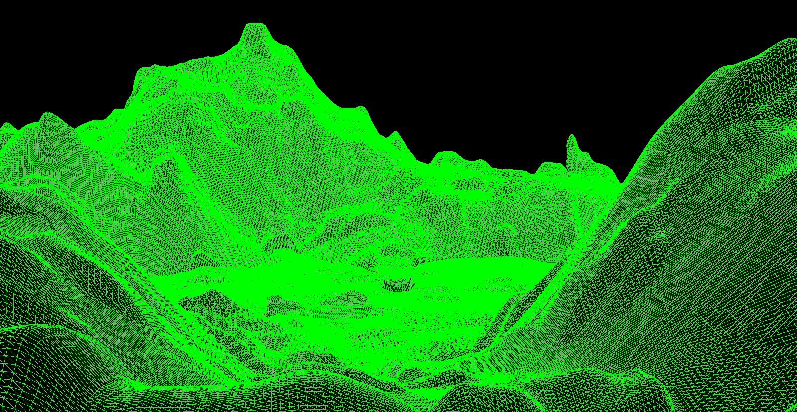
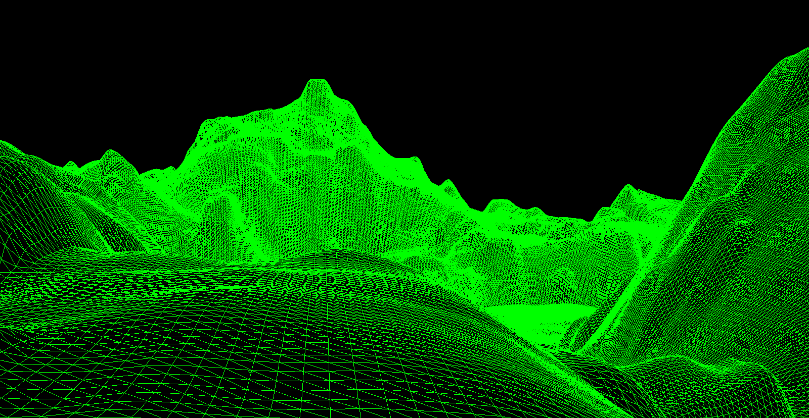

### Z-Terrain

This is a small demo of random terrain generation and visiualisation using pseudo random noise functions, opengl, and c++.

## Building

Build Dependencies ( and their package names on ubuntu )
-   build-essential ( build-essential )
-   sdl ( libsdl-dev )
-   freeglut3 (freeglut3-dev )
-   glew ( libglew-dev )
-   glm ( libglm-dev )

## Screenshots

